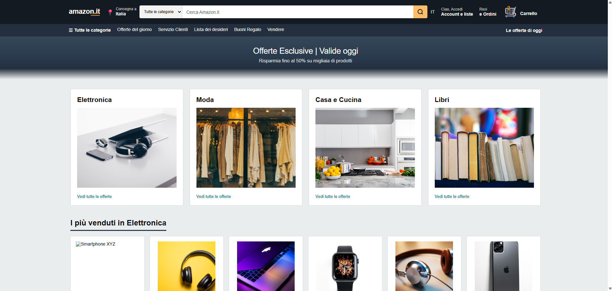
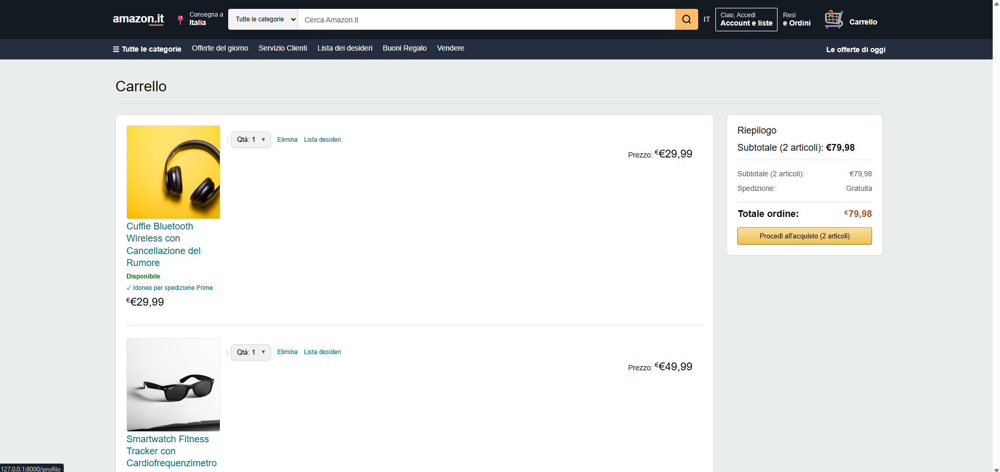
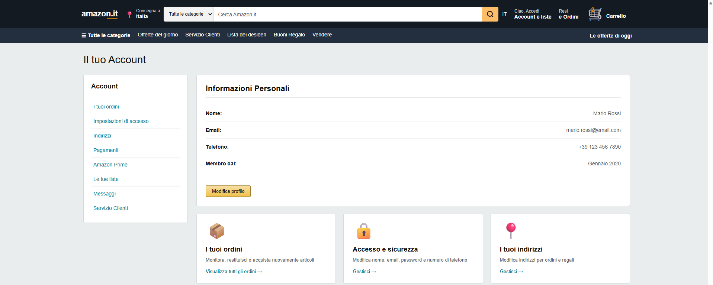
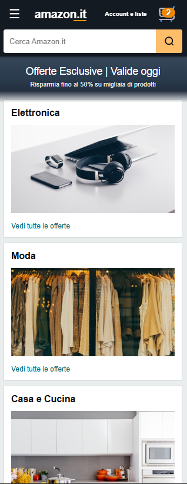
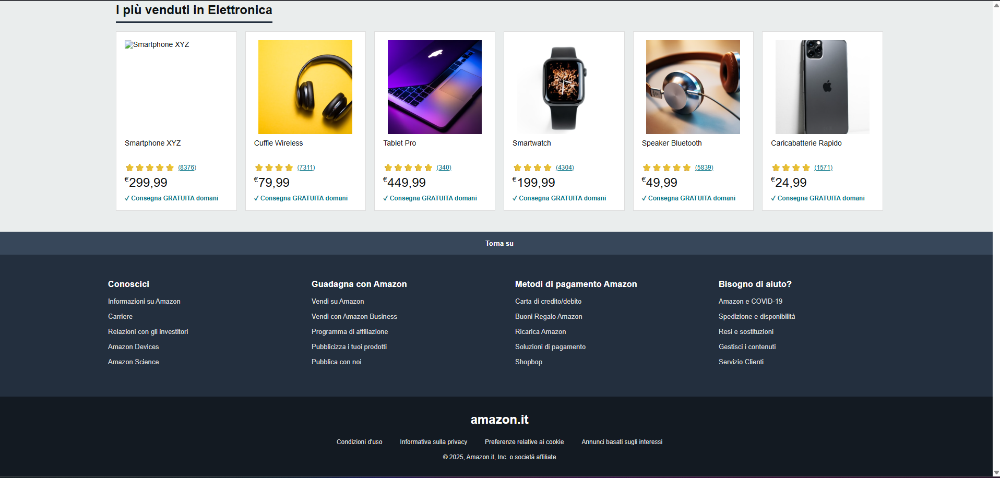
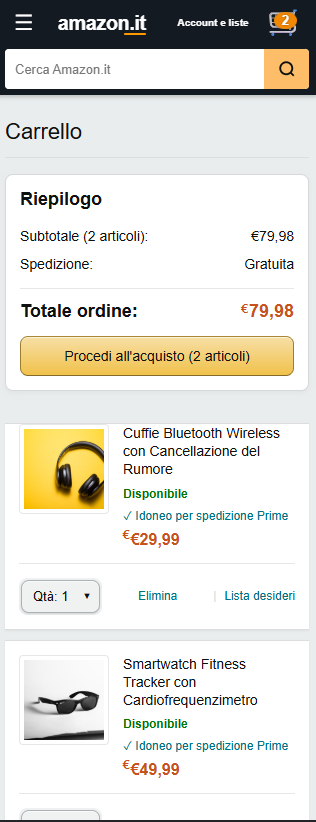

# 🛒 Clone Amazon.it - Piattaforma E-commerce Laravel

[](https://laravel.com)
[](https://php.net)
[](https://laravel.com/docs/blade)
[](https://developer.mozilla.org/en-US/docs/Web/CSS)
[](https://developer.mozilla.org/en-US/docs/Web/JavaScript)

[](LICENSE)
[](https://github.com/Fabio-Bianco)
[](https://github.com/Fabio-Bianco/amazon-clone-laravel/pulls)
[](https://github.com/Fabio-Bianco/amazon-clone-laravel)

> **Clone pixel-perfect di Amazon.it** realizzato con Laravel, con design responsive, pattern UI/UX moderni e funzionalità e-commerce complete.

🌍 **[Read in English](README_EN.md)**

---

## 🎯 Panoramica del Progetto

Questo progetto è una **ricreazione ad alta fedeltà di Amazon.it**, sviluppata come piattaforma e-commerce full-stack per dimostrare competenze avanzate di sviluppo web. Ogni dettaglio—dai codici colore ai pattern di interazione—è stato accuratamente realizzato per corrispondere al design system di Amazon.

### 🎨 Filosofia di Design

- **Fedeltà Amazon al 98%**: Palette colori esatta (`#131A22`, `#C7511F`, `#F0C14B`)
- **Approccio Mobile-First**: Completamente responsive da 320px a display 4K
- **Pattern UX Autentici**: Header sticky, menu hamburger, controlli ottimizzati per touch
- **Ottimizzato per le Performance**: Lazy loading, asset ottimizzati, animazioni fluide

---

## 📸 Screenshot

### 🖥️ Esperienza Desktop

#### Homepage

*Banner hero con card categorie e griglia prodotti in evidenza*

#### Carrello

*Interfaccia carrello pulita con selettori quantità e riepilogo prezzi*

#### Profilo Utente

*Gestione account con navigazione sidebar e card azioni*

---

### 📱 Esperienza Mobile

<table>
<tr>
<td width="33%">

#### Header Mobile

*Header sticky con menu hamburger*

</td>
<td width="33%">

#### Menu Hamburger

*Navigazione slide-in*

</td>
<td width="33%">

#### Carrello Mobile

*Articoli carrello ottimizzati per touch*

</td>
</tr>
</table>

---

## ✨ Caratteristiche Principali

### 🎨 **Eccellenza Frontend**
- **UI Pixel-Perfect**: Codici colore, tipografia e spaziatura esatti di Amazon
- **CSS Grid/Flexbox Avanzato**: Layout responsive complessi
- **Componenti Custom**: Selettori quantità, stelle valutazione, badge Prime
- **Animazioni Fluide**: Stati hover, stati attivi, transizioni cubic-bezier
- **Gesture Mobile**: Scrolling ottimizzato per touch, elementi sticky

### 🏗️ **Architettura**
- **Pattern MVC**: Separazione netta delle responsabilità
- **Blade Templating**: Layout e componenti riutilizzabili
- **Route RESTful**: Route nominative con routing Laravel
- **CSS Component-Based**: Fogli di stile modulari (layout, homepage, carrello, profilo)

### 📱 **Design Responsive**
- **7 Breakpoint**: 400px, 600px, 768px, 900px, 1024px, 1200px, 1400px
- **CSS Mobile-First**: Approccio progressive enhancement
- **Touch-Friendly**: Target touch minimi di 44px (linee guida iOS)
- **Layout Adattivi**: Colonne griglia che si adattano fluidamente

### 🎯 **Pattern UX**
- **Menu Hamburger**: Sidebar slide-in con overlay
- **Elementi Sticky**: Header (z-index: 1000), navigazione sidebar
- **Micro-interazioni**: Scale pulsanti, sottolineature link, ombre
- **Badge Carrello Amazon**: Sfondo trasparente con ombra

---

## 🛠️ Stack Tecnologico

| Tecnologia | Scopo |
|------------|-------|
| **Laravel 11.x** | Framework backend (MVC, routing, Blade) |
| **PHP 8.2+** | Logica server-side |
| **Blade Templates** | Layer view con ereditarietà |
| **Vanilla CSS3** | Styling custom (Grid, Flexbox, animazioni) |
| **JavaScript (ES6+)** | Toggle sidebar, elementi interattivi |
| **Unsplash API** | Immagini placeholder prodotti |

---

## 📂 Struttura del Progetto

```
laravel-esercitazione/
├── app/Http/Controllers/
│   ├── HomeController.php
│   ├── CartController.php
│   └── ProfiloController.php
├── resources/views/
│   ├── layouts/app.blade.php      # Layout master
│   ├── homepage.blade.php         # Landing page
│   ├── carrello.blade.php         # Carrello acquisti
│   └── profilo.blade.php          # Profilo utente
├── public/css/
│   ├── layout.css                 # Header, nav, footer
│   ├── homepage.css               # Stili homepage
│   ├── carrello.css               # Stili carrello
│   └── profilo.css                # Stili profilo
└── routes/web.php                 # Route applicazione
```

---

## 🚀 Installazione e Setup

### Prerequisiti
- PHP 8.2+
- Composer
- Node.js & NPM

### Avvio Rapido

```bash
# Clona repository
git clone https://github.com/Fabio-Bianco/laravel-esercitazione.git
cd laravel-esercitazione

# Installa dipendenze
composer install

# Setup ambiente
cp .env.example .env
php artisan key:generate

# Avvia server di sviluppo
php artisan serve
```

Visita `http://localhost:8000`

---

## 🎨 Design System

### Palette Colori (Amazon Ufficiale)
```css
/* Colori Primari */
--amazon-header: #131A22;
--amazon-nav: #232F3E;
--amazon-orange: #FF9900;
--amazon-yellow: #F0C14B;

/* Colori Interattivi */
--link-blue: #007185;
--link-hover: #C7511F;
--success-green: #007600;

/* Colori Neutri */
--text-primary: #0F1111;
--border-gray: #D5D9D9;
--background-gray: #EAEDED;
```

### Tipografia
- **Font**: Amazon Ember (fallback: Arial)
- **Dimensione Base**: 14px
- **Intestazioni**: 18px - 32px

---

## 📱 Breakpoint Responsive

| Breakpoint | Larghezza | Layout |
|------------|-----------|--------|
| **Mobile Piccolo** | ≤400px | 1 colonna |
| **Mobile** | ≤600px | Menu hamburger |
| **Tablet Portrait** | ≤768px | 2 colonne |
| **Tablet Landscape** | ≤1024px | 3 colonne |
| **Desktop** | ≤1400px | 4-6 colonne |

---

## 🎯 Competenze Acquisite

### Competenze Frontend
✅ Implementazione UI pixel-perfect  
✅ CSS Grid & Flexbox avanzato  
✅ Design responsive mobile-first  
✅ Ottimizzazione performance  

### Competenze Backend
✅ Architettura MVC Laravel  
✅ Motore templating Blade  
✅ Pattern routing RESTful  
✅ Modularità del codice  

### Design UX/UI
✅ Padronanza design system Amazon  
✅ Interfacce ottimizzate per touch  
✅ Design micro-interazioni  
✅ Gerarchia visiva  

---

## 🔮 Sviluppi Futuri

- [ ] Integrazione database MySQL
- [ ] Autenticazione utenti (Laravel Breeze)
- [ ] Logica sessione carrello
- [ ] Funzionalità ricerca prodotti
- [ ] Gateway pagamento (Stripe)
- [ ] Pannello admin
- [ ] API RESTful
- [ ] Testing Unit/Feature

---

## 👨‍💻 Informazioni sullo Sviluppatore

**Fabio Bianco** - Full-Stack Web Developer

Questo progetto dimostra la mia capacità di:
- Effettuare reverse-engineering di UI complesse con estrema attenzione ai dettagli
- Costruire applicazioni responsive mobile-first
- Scrivere codice pulito e manutenibile
- Rilasciare funzionalità production-ready

### 🔗 Contatti
- 💼 LinkedIn: [Il Tuo Profilo](https://linkedin.com/in/your-profile)
- 🐙 GitHub: [Fabio-Bianco](https://github.com/Fabio-Bianco)
- 📧 Email: your.email@example.com

---

## 📄 Licenza

Licenza MIT - vedi [LICENSE](LICENSE)

---

<div align="center">

### ⭐ Metti una stella a questo repo se l'hai trovato utile!

Fatto con ❤️ da [Fabio Bianco](https://github.com/Fabio-Bianco)

</div>
